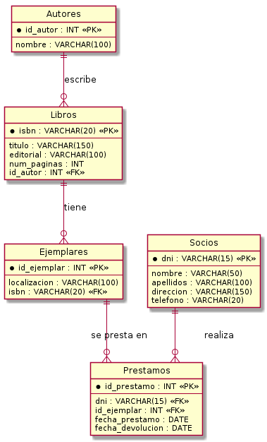

= Informe de Proyecto: Equipo-14
:author: Allan González, Andrés Reyes, Fernando Reyes, Mitchael Ruíz
:revnumber: 1.0
:revdate: {localdate}
:toc: left 
:toc-tittle: Contenidos
:sectnums:
:source-highligther: rouge
:icons: font

== Introducción
Este documento detalla el diseño y la implementación de la base de datos relacional para la gestión de una biblioteca. El sistema está orientado a controlar el inventario de libros, sus autores, los ejemplares físicos disponibles y el registro de préstamos realizados por los usuarios o socioes de la institución.

== Equipo de Trabajo (Equipo -14) 
* **Integrantes:**
** Allan González (V-28.660.376)
** Andŕes Reyes (V-30.520.333)
** Fernando Reyes (V-30.159.566)
** Mitchael Ruíz (V-31.416.127)
* **Sección:** DCM0501VI

== Ejercicio 14
“En la biblioteca del centro se manejan fichas de autores y libros. En la ficha de cada
autor se tiene el código de autor y el nombre. De cada libro se guarda el código, título,
ISBN, editorial y número de página. Un autor puede escribir varios libros, y un libro puede
ser escrito por varios autores. Un libro está formado por ejemplares. Cada ejemplar tiene
un código y una localización. Un libro tiene muchos ejemplares y un ejemplar pertenece
sólo a un libro.
Los usuarios de la biblioteca del centro también disponen de ficha en la biblioteca y sacan
ejemplares de ella. De cada usuario se guarda el código, nombre, dirección y teléfono.
Los ejemplares son prestados a los usuarios. Un usuario puede tomar prestados varios
ejemplares, y un ejemplar puede ser prestado a varios usuarios. De cada préstamos
interesa guardar la fecha de préstamo y la fecha de devolución”.

== Herramientas y Entorno
El desarrollo se realizó bajo un entorno
**Linux Debian 12**, utilizando:
* **Maria Db:** Para el almacenamiento de datos.
* **PlantUML:** Para el modelado del diagrama entidad-relación.
* **Asiidoctor:** Para la generación de esta documentación ténica. 

== Diseño Relacional (Esquema)
El modelo se basa en una estructura jerárquica donde un autor puede escribir varios libros, y cada libro puede tener múltiples ejemplares físicos para préstamo.

.Diagrama Relacional - Sistema de Biblioteca
 

== Implementación SQL
A continuación se detalla el script para crear la base de datos `biblioteca` y sus tablas correspondientes con sus restricciones de integridad.

[source,sql]
----
CREATE DATABASE biblioteca;
USE biblioteca;

CREATE TABLE autores (
    id_autor INT AUTO_INCREMENT PRIMARY KEY,
    nombre VARCHAR(100) NOT NULL
);

CREATE TABLE libros (
    isbn VARCHAR(20) PRIMARY KEY,
    titulo VARCHAR(150) NOT NULL,
    editorial VARCHAR(100),
    num_paginas INT,
    id_autor INT,
    CONSTRAINT fk_libro_autor FOREIGN KEY (id_autor) 
        REFERENCES autores(id_autor) ON DELETE CASCADE
);

CREATE TABLE ejemplares (
    id_ejemplar INT AUTO_INCREMENT PRIMARY KEY,
    localizacion VARCHAR(100),
    isbn VARCHAR(20),
    CONSTRAINT fk_ejemplar_libro FOREIGN KEY (isbn) 
        REFERENCES libros(isbn) ON DELETE CASCADE
);

CREATE TABLE socios (
    dni VARCHAR(15) PRIMARY KEY,
    nombre VARCHAR(50) NOT NULL,
    apellidos VARCHAR(100) NOT NULL,
    direccion VARCHAR(150),
    telefono VARCHAR(20)
);

CREATE TABLE prestamos (
    id_prestamo INT AUTO_INCREMENT PRIMARY KEY,
    dni VARCHAR(15),
    id_ejemplar INT,
    fecha_prestamo DATE NOT NULL,
    fecha_devolucion DATE,
    CONSTRAINT fk_prestamo_socio FOREIGN KEY (dni) 
        REFERENCES socios(dni) ON DELETE CASCADE,
    CONSTRAINT fk_prestamo_ejemplar FOREIGN KEY (id_ejemplar) 
        REFERENCES ejemplares(id_ejemplar) ON DELETE CASCADE
);

----

== Estructura de Archivos 
Para la entrega final en el archivo `.rar`, se ha organizado la carpeta de la siguiente manera:

[source,text]
----
eval-4/
└── equipo-14/
    ├── biblioteca.sql
    └── doc/
        ├── index.adoc
        ├── build
            └── index.html
        └── recursos/
            └── img-biblioteca.png
            └── diagrama-r.puml
----
